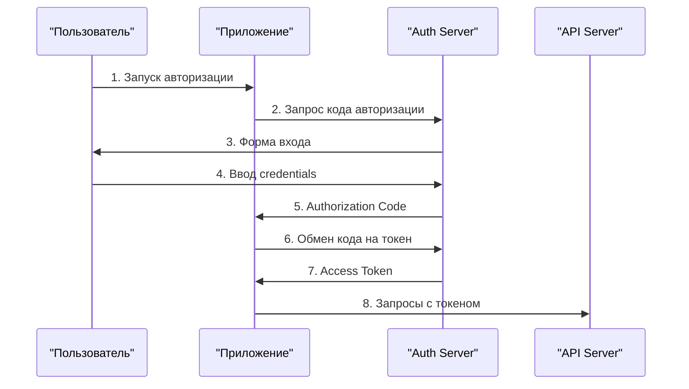

# Руководство по OAuth авторизации cTrader Open API

Этот документ подробно описывает процесс OAuth 2.0 авторизации для cTrader Open API согласно [официальной документации](https://help.ctrader.com/open-api/account-authentication/).

## 📋 Оглавление

1. [Обзор OAuth процесса](#обзор-oauth-процесса)
2. [Настройка приложения](#настройка-приложения)
3. [Параметры авторизации](#параметры-авторизации)
4. [Потоки авторизации](#потоки-авторизации)
5. [Обработка токенов](#обработка-токенов)
6. [Использование с API](#использование-с-api)
7. [Безопасность](#безопасность)
8. [Решение проблем](#решение-проблем)

## 🔐 Обзор OAuth процесса

cTrader Open API использует **OAuth 2.0 Authorization Code Flow** для безопасной авторизации приложений. Этот процесс состоит из следующих этапов:

### Основные участники

- **Resource Owner** (Владелец ресурса) - пользователь с cTrader ID
- **Client** (Клиент) - ваше Python приложение
- **Authorization Server** (Сервер авторизации) - cTrader Auth Server
- **Resource Server** (Сервер ресурсов) - cTrader Open API

### Поток авторизации



## ⚙️ Настройка приложения

### 1. Создание приложения в cTrader ID Portal

1. Перейдите на [cTrader ID Portal](https://id.ctrader.com/)
2. Войдите в ваш cTrader ID аккаунт
3. Перейдите в раздел **"Applications"**
4. Нажмите **"Create New Application"**

### 2. Конфигурация приложения

#### Application Details
- **Application Name**: Название вашего приложения
- **Description**: Описание функций приложения
- **Application Type**: 
  - `Desktop Application` - для локальных приложений
  - `Web Application` - для веб-приложений

#### Redirect URIs
Добавьте URI, на которые будет перенаправлен пользователь после авторизации:

**Для разработки:**
```
http://localhost:8080/auth/callback
```

**Для продакшн:**
```
https://yourdomain.com/auth/callback
```

⚠️ **Важно**: URI должны точно совпадать с теми, что используются в коде!

### 3. Получение учетных данных

После создания приложения сохраните:
- **Client ID** - публичный идентификатор приложения
- **Client Secret** - секретный ключ (храните в безопасности!)

## 📝 Параметры авторизации

### URL авторизации
```
https://openapi.ctrader.com/apps/auth
```

### Обязательные параметры

| Параметр | Описание | Пример |
|----------|----------|---------|
| `client_id` | ID вашего приложения | `your_client_id` |
| `redirect_uri` | URI для редиректа | `http://localhost:8080/auth/callback` |
| `response_type` | Тип ответа (всегда `code`) | `code` |
| `scope` | Область доступа | `trading` или `accounts` |

### Опциональные параметры

| Параметр | Описание | Значения |
|----------|----------|----------|
| `product` | Тип интерфейса | `web` (убирает header/footer) |
| `state` | Защита от CSRF | Случайная строка |

### Области доступа (Scope)

#### `accounts` - Только чтение
- Информация об аккаунте
- Баланс и статистика
- Исторические данные
- **НЕ позволяет** торговые операции

#### `trading` - Полный доступ
- Все возможности `accounts`
- Размещение/отмена ордеров
- Управление позициями
- Изменение Stop Loss / Take Profit

## 🔄 Потоки авторизации

### 1. Получение Authorization Code

```python
from ctrader_open_api_async import AsyncAuth

async with AsyncAuth(client_id, client_secret, redirect_uri) as auth:
    # Создание URL авторизации
    auth_url = auth.get_auth_uri(scope="trading")
    print(f"Перейдите по ссылке: {auth_url}")
```

Пользователь перенаправляется на:
```
https://openapi.ctrader.com/apps/auth?
  client_id=YOUR_CLIENT_ID&
  redirect_uri=http://localhost:8080/auth/callback&
  response_type=code&
  scope=trading
```

### 2. Обработка Redirect

После авторизации пользователь перенаправляется на:
```
http://localhost:8080/auth/callback?code=AUTHORIZATION_CODE
```

### 3. Обмен кода на токен

```python
# Извлечение кода из URL
auth_code = "код_из_redirect_url"

# Обмен на токен
token_data = await auth.get_token(auth_code)
access_token = token_data['access_token']
refresh_token = token_data.get('refresh_token')
```

## 🎫 Обработка токенов

### Структура ответа

```json
{
  "access_token": "eyJhbGciOiJSUzI1NiIsImtpZCI6...",
  "token_type": "Bearer",
  "expires_in": 2628000,
  "refresh_token": "def50200a1b2c3d4e5f6...",
  "scope": "trading"
}
```

### Время жизни токенов

- **Access Token**: ~30 дней (2,628,000 секунд)
- **Refresh Token**: Не имеет срока истечения

### Обновление токена

```python
async with AsyncAuth(client_id, client_secret, redirect_uri) as auth:
    new_token_data = await auth.refresh_token(refresh_token)
    new_access_token = new_token_data['access_token']
```

## 🔌 Использование с API

### 1. Аутентификация приложения

```python
from ctrader_open_api_async import AsyncClient, EndPoints

async with AsyncClient(EndPoints.PROTOBUF_DEMO_HOST, EndPoints.PROTOBUF_PORT) as client:
    # Аутентификация приложения
    await client.send_application_auth_req(client_id, client_secret)
```

### 2. Получение аккаунтов

```python
# Получение списка аккаунтов по access token
accounts_response = await client.send_get_account_list_by_access_token_req(access_token)
accounts = list(accounts_response.ctidTraderAccount)
```

### 3. Авторизация торгового аккаунта

```python
# Выбор первого аккаунта
account_id = accounts[0].ctidTraderAccountId

# Авторизация для торговых операций
await client.send_account_auth_req(account_id, access_token)
```

### 4. Выполнение операций

```python
# Теперь можно выполнять любые операции
trader_info = await client.send_trader_req(account_id)
symbols = await client.send_symbols_list_req(account_id)
```

## 🛡️ Безопасность

### Хранение секретов

```python
import os

# Используйте переменные окружения
CLIENT_ID = os.getenv('CTRADER_CLIENT_ID')
CLIENT_SECRET = os.getenv('CTRADER_CLIENT_SECRET')

# Никогда не храните в коде:
# CLIENT_SECRET = "your_secret_here"  # ❌ НЕ ДЕЛАЙТЕ ТАК!
```

### Валидация Redirect URI

```python
from urllib.parse import urlparse

def validate_redirect_uri(uri, registered_uris):
    """Проверка redirect URI на соответствие зарегистрированным."""
    parsed = urlparse(uri)
    return uri in registered_uris and parsed.scheme in ['http', 'https']
```

### Защита от CSRF

```python
import secrets

# Генерация state параметра
state = secrets.token_urlsafe(32)

# Включение в URL авторизации
auth_url = auth.get_auth_uri(scope="trading", state=state)

# Проверка при получении кода
if received_state != state:
    raise SecurityError("CSRF token mismatch")
```

## 🆘 Решение проблем

### Ошибка: "Invalid redirect URI"

**Причины:**
- URI не зарегистрирован в приложении
- Различие в протоколе (http vs https)
- Различие в порте или пути

**Решение:**
1. Проверьте точное соответствие URI в настройках приложения
2. Убедитесь в правильности протокола
3. Проверьте порт и путь

### Ошибка: "Invalid authorization code"

**Причины:**
- Код уже был использован
- Истек срок действия (1 минута)
- Неправильное извлечение кода из URL

**Решение:**
1. Получите новый код авторизации
2. Обменяйте код на токен сразу после получения
3. Проверьте корректность извлечения кода

### Ошибка: "Invalid client credentials"

**Причины:**
- Неправильный Client ID или Client Secret
- Приложение деактивировано
- Проблемы с кодировкой символов

**Решение:**
1. Проверьте правильность учетных данных
2. Убедитесь, что приложение активно
3. Проверьте отсутствие лишних пробелов

### Ошибка: "Access token expired"

**Причины:**
- Истек срок действия токена (~30 дней)

**Решение:**
```python
try:
    # Попытка использования токена
    response = await client.send_trader_req(account_id)
except Exception as e:
    if "token expired" in str(e).lower():
        # Обновление токена
        new_token_data = await auth.refresh_token(refresh_token)
        access_token = new_token_data['access_token']
        # Повторная попытка
        response = await client.send_trader_req(account_id)
```

## 📚 Примеры реализации

### Полный автоматический поток

См. `examples/oauth_auth_example.py` - запускает локальный сервер и автоматически обрабатывает redirect.

### Упрощенный поток

См. `examples/simple_oauth_example.py` - ручной ввод кода авторизации.

### Веб-приложение

```python
from aiohttp import web

async def auth_handler(request):
    """Обработчик redirect URI для веб-приложения."""
    code = request.query.get('code')
    if code:
        # Обмен кода на токен
        token_data = await auth.get_token(code)
        # Сохранение токена в сессии/базе данных
        return web.json_response({"status": "success"})
    else:
        return web.json_response({"status": "error"}, status=400)

app = web.Application()
app.router.add_get('/auth/callback', auth_handler)
```

## 🔗 Полезные ссылки

- [cTrader Open API Documentation](https://help.ctrader.com/open-api/)
- [OAuth 2.0 Authentication Flow](https://help.ctrader.com/open-api/account-authentication/)
- [cTrader ID Portal](https://id.ctrader.com/)
- [RFC 6749 - OAuth 2.0 Authorization Framework](https://tools.ietf.org/html/rfc6749)

## 📞 Поддержка

Если у вас возникли вопросы по OAuth авторизации:

- 📖 Изучите [официальную документацию](https://help.ctrader.com/open-api/account-authentication/)
- 🔍 Проверьте [примеры в репозитории](examples/)
- 🐛 [Создайте issue](https://github.com/paxelcool/ctrader-open-api-async/issues)

---

**Дата обновления**: 2025-01-31  
**Версия библиотеки**: 2.0.0+ 